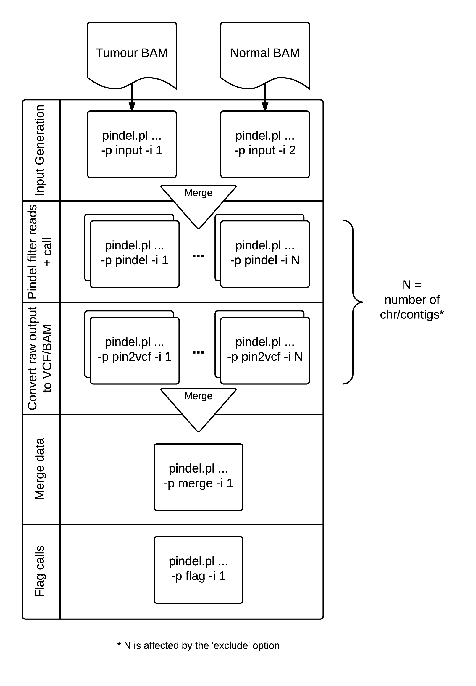

# Execution

There are 2 ways to execute cgpPindel processing depending on the systems available to you.

1. [Single host execution](#single-host-execution).
2. [Farm style execution](#farm-style-execution).

Option (2) provides more control over the individual steps in the process flow but for most low usage users the single host execution method should be suitable.

## Single host execution

Single host execution does require a host with a decent level of resources.  Minimum specification:

* CPU - 2 (recommend 4)
    * 1,2 can result in very long run times
    * 6 is possible but high memory usage
    * must be divisible by 2 (other than 1)
* GB RAM - 8GB per Core used
    * Some data will require much higher values

These are based on processing of human WGS data sets of 30X coverage.

Please note, the code will recover from any failure point and not re-do anything
un-necessarily.  You can freely modify `-cpus` on each re-start if you are hitting memory limits.

Please see the command line help for the most up to date options.

## Farm style execution

For users with access to a compute farm it is possible to break down the execution
into the component parts (see [Overview](#overview-of-workflow)).

There are 5 steps:

1. Input generation
    * Generates pindel pseudo fasta input files.
    * Base command suffixed with `-p input -i X`.
    * where `X` can be 1-2.
2. Pindel filtering and calling
    * Prefiltering of input reads followed by execution of pindel binary.
    * Base command suffixed with `-p pindel -i X`.
    * where `X` is [1-N](#number-of-contigs).
3. Conversion to BAM/VCF
    * Converts Pindel text alignments to BAM records on per contig basis.
    * Creates VCF files on per contig basis.
    * Base command suffixed with `-p pin2vcf -i X`.
    * where `X` is [1-N](#number-of-contigs).
4. Merge to sample level VCF/BAMs
    * Base command suffixed with `-p merge -i 1`.
5. Run flagging
    * Base command suffixed with `-p flag -i 1`.
    * Mark events as `PASS` where appropriate. Please see [Vcf Filters](VcfFilters) for details.

# Overview of workflow

#### Number of contigs

The number of contigs is calculated to be the total number of references found in ref.fa.fai, less any that conform to the `-exclude` pattern.  For example in GRCh37d5 there are 86 contigs:

* Standard chromosomes: 1-22+X,Y,MT
* Decoy sequence: hs37d5
* HPV sequence: NC_007605
* Unlocalized genomic contigs: GL*

The recommended exclude pattern for this genome build is `-e NC_007605,hs37d5,GL%`.  This results in N being 25 for the `-p pindel` and `-p pin2vcf` steps described above/below.

